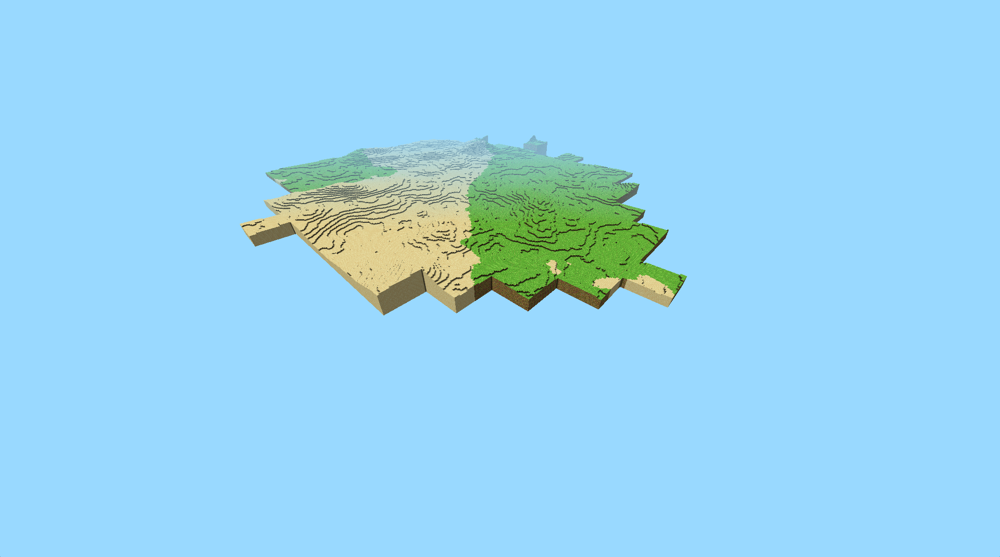
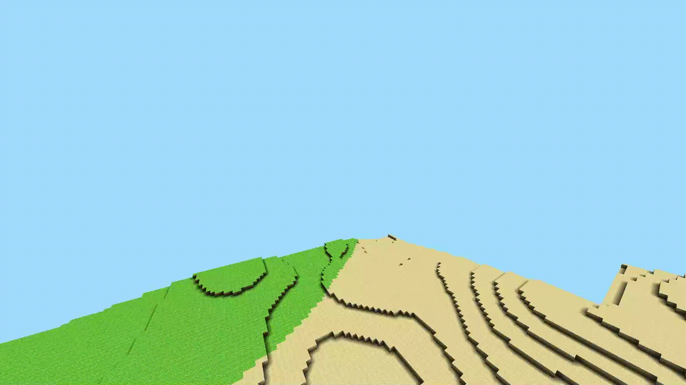
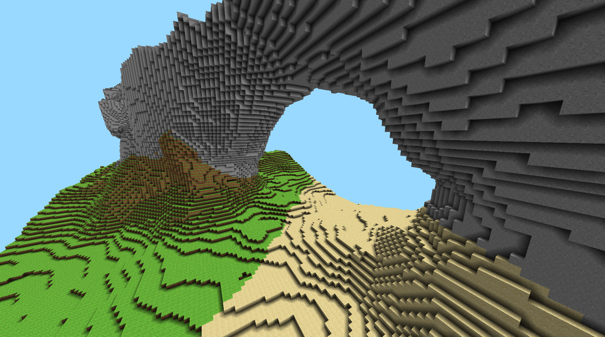
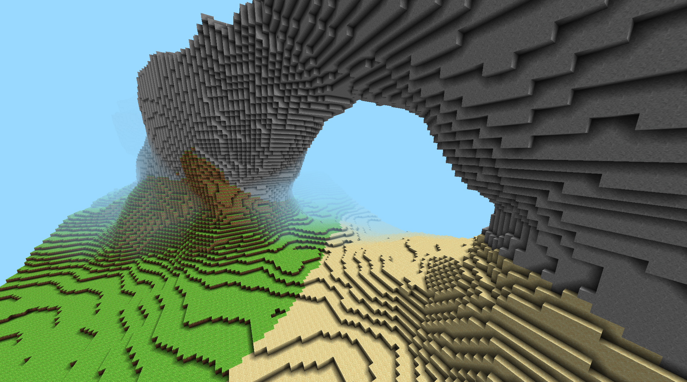
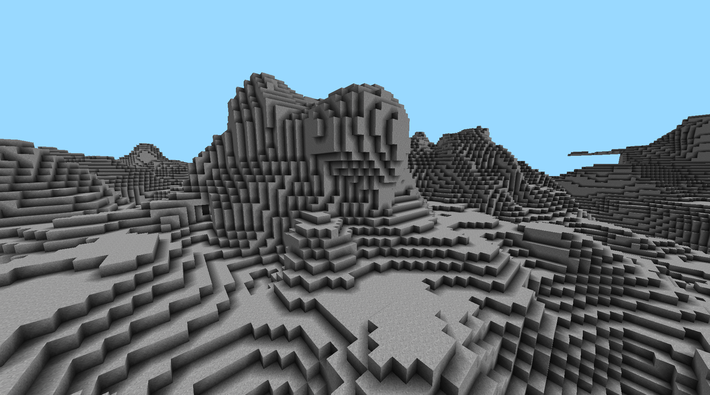
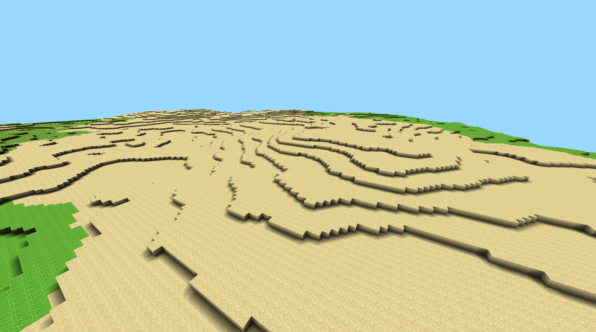
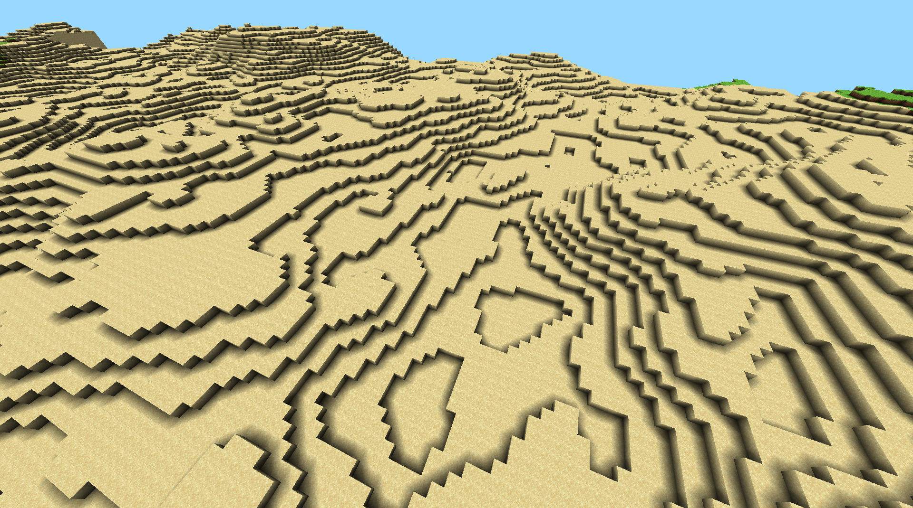
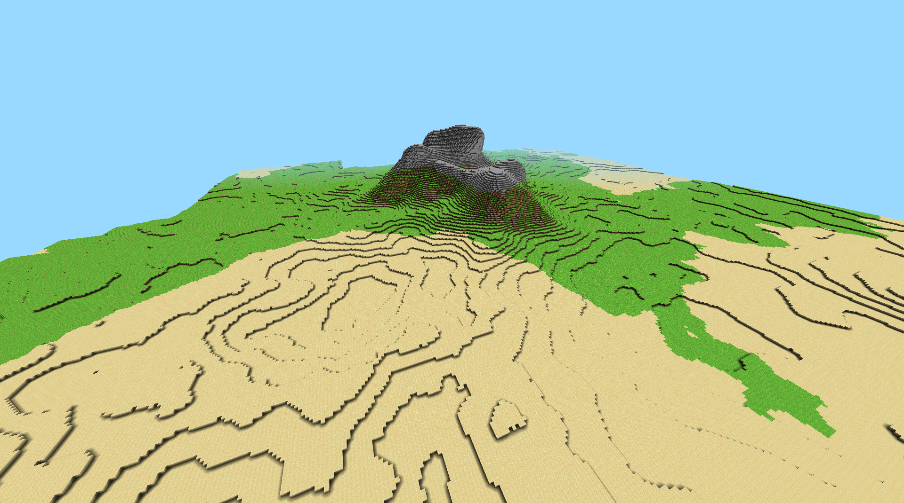

# Modular Infinite Network of Dynamic Cubic Realms And Fractal Terrain (MINDCRAFT)

## Installation

1. `pip install pygame moderngl PyGLM numba opensimplex`
2. Run `main.py`

Tested on Windows 11 with Python 3.11.7. On WSL2, line 13 and 38 in `main.py` need to be commented out and the mouse input is buggy.

## Features
### Chunk Datastructure
The world is split up into chunks of 32x32x32 voxels. Chunks are stored in a dictionary with their coordinates as keys. This allows for infinite worlds, as chunks are only generated when they are needed. All chunks in a given generation radius around the player are generated, starting at the closest to the player and moving outwards. Chunk culling is used to only render chunks that are visible to the player. 

Another benefit of seperating the world into chunks is that each chunk can be rendered as a single mesh, which is much more efficient than rendering each voxel individually. When voxels are added, modified or removed, only the mesh of the chunk that contains the voxel is updated (and the meshes of the neighbouring chunks, if the voxel is on the edge of the chunk).

### Shading
Simply applying a texture to each face of a voxel looks very flat and it is impossible to make out any details in the terrain. To make it look more realistic, we apply a few simple and cheap shading techniques.
#### No Shading

#### Directional Shading
To differentiate the faces of the voxels, we can make some faces darker than others. Usually the top faces are the brightest and the side faces are darker. This emulates a light source that is directly above the terrain, e.g. the sun at noon. The brightness values of the faces are precomputed values between 0 and 1 and simply multiplied with the texture color.

#### Ambient Occlusion
From certain angles, only one type of face (e.g. the top face) is visible. The simple directional shading doesn't help here and it still looks very flat. To fix this, we can use ambient occlusion. It is a technique that adds shadows to parts where objects meet or overlap. In our case, it will make edges that are between two diagonal voxels darker. The ambient occlusion value is also precomputed and determined by how many voxels are around a given face.

#### Fog
Lastly, we can add some fog to the scene. This blends far away terrain with the skybox color, making it look like the terrain is fading into the distance. This also hides the abrubt end of the terrain that is caused by the finite generation radius. The fog density is determined by applying an exponential falloff to the distance between the camera and the terrain.

### Terrain Generation

We can utilite fractal noise (multiple layers of perlin noise) to generate terrain. To enable the generation of more complex structures such as overhangs and arches, we use 3-dimensional noise. The noise or density is sampled at each voxel position and the result is compared to a threshold value, determining whether the voxel is solid or not. To make it look natural, we lower the density of the terrain as the height increases. This is done by subtracting a normalization value from the noise, depending on its height.

#### 2D Terrain

#### 3D Terrain

#### Modulation
The 3D terrain already looks quite nice, but it is very repetitive. To add more variety, we can use another layer of noise to modulate certain properties of the terrain. For example, we can use it to change the intensity of the height normalization, making some parts of the terrain flatter than others. We can also use it to interpolate between high frequency and low frequency noise, adding more detail to the terrain.

High flatness

Small noise

#### Biomes
To add even more variety, we can use yet another layer of noise, in this case called humidity, to determine the biome of each voxel. With a few simple rules we can create diverse worlds. In this example, we use the humidity and flatness to determine the biome from the three possible biomes: desert, grassland and mountain. The biome determines which texture is applied to the voxel.

## Future Work

- Add more biomes
- Add more textures
- Add structures such as trees
- Add water (+ transparency)
- Reimplement block breaking and placing
- Opimize world generation

## Acknowledgments

Parts of the engine follow this [tutorial](https://www.youtube.com/watch?v=Ab8TOSFfNp4) on YouTube.

- [Amanatides, John & Woo, Andrew. (1987). A Fast Voxel Traversal Algorithm for Ray Tracing](http://www.cse.yorku.ca/~amana/research/grid.pdf)